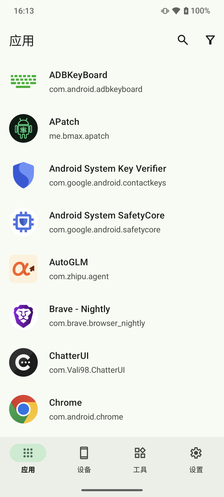
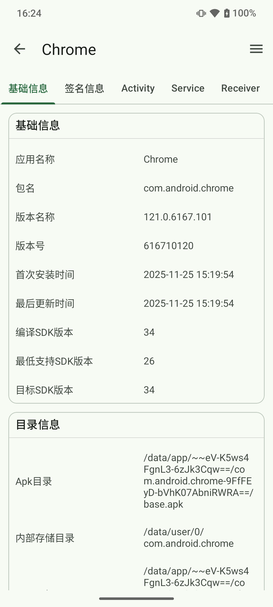
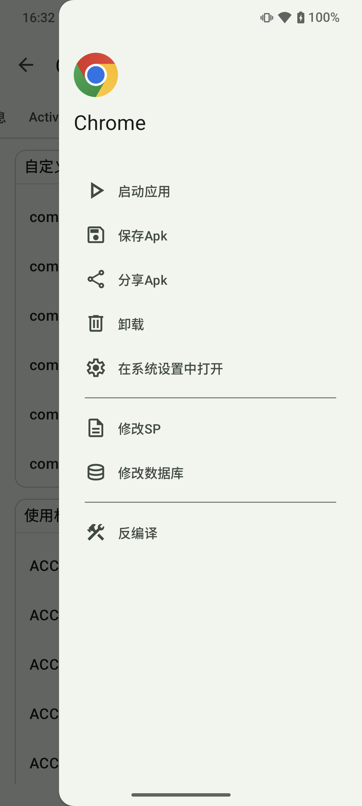
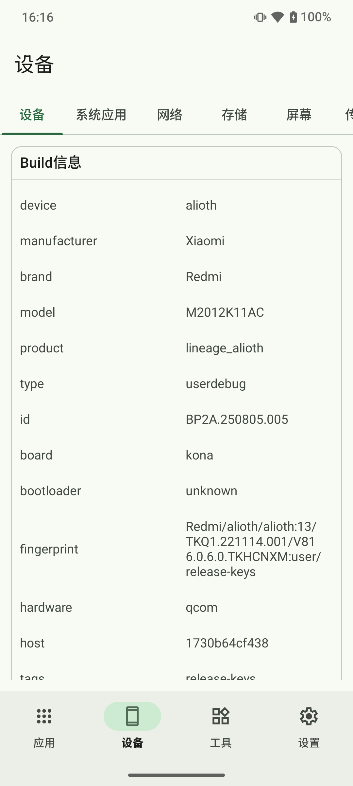
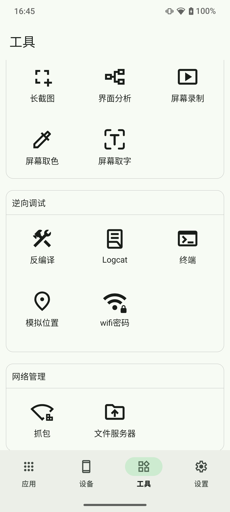

# 📱 OneDroid - 系统级Android全能工具箱

> 一款功能强大的安卓多功能工具集，集成了多种实用工具，帮助用户更好地管理和了解自己的安卓设备。

中文 | [English](README_EN.md)  

官方网站: [https://qingge.tech/onedroid/web/](https://qingge.tech/onedroid/web/)

## 🚀 特性

- 📦 **应用管理**:
  - 应用列表
  - 基础信息、签名、权限、组件
  - 应用操作（启动、提取、卸载、修改内部文件、反编译）

- 📱 **设备管理**：
  - 设备、系统、CPU、GPU、内存、存储、屏幕、网络、位置、传感器、相机、温度、PROP
- 🔧 **小工具合集**：
    - 屏幕分析：长截图(待完善)、界面分析、屏幕录制、屏幕取色、屏幕取字
    - 逆向调试：反编译、Logcat(待实现)、终端(待实现)、模拟位置(待实现)、wifi密码(需要root)
    - 网络管理：抓包(待实现)、文件服务器(待实现)
## 💾 下载

在 [Release页面](https://github.com/QingGeTech/OneDroid/releases) 下载最新的APK

## 📸 截图展示

### 应用管理

| 应用列表 | 基础信息 | 应用操作 |
|---------|---------|--------|
|  |  |  |

### 设备管理 & 小工具合集

| 设备信息 | 小工具合集 |
|---------|----------|
|  |  |

## ⚠️ 免责声明

本工具仅供学习与技术交流使用，请勿将其用于任何非法用途，使用该软件产生的任何法律后果由使用者自行承担。

详情参考：
- [用户协议](https://qingge.tech/onedroid/user-protocol.html)
- [隐私政策](https://qingge.tech/onedroid/privacy-policy.html)

## 📄 许可协议

本项目采用 [CC BY-NC-SA 4.0 (署名-非商业性使用-相同方式共享 4.0 国际)](https://creativecommons.org/licenses/by-nc-sa/4.0/deed.zh-hans) 许可协议。

### 核心条款：
- **署名 (Attribution)**：您必须给出适当的署名，并提供指向本许可协议的链接。
- **非商业性使用 (Non-Commercial)**：您不得将本作品用于任何形式的商业目的（包括但不限于：直接出售、在应用内加入广告、用于付费课程、或作为收费服务的组成部分）。
- **相同方式共享 (ShareAlike)**：如果您再混合、转换或基于本作品进行创作，您必须基于与原先许可协议相同的许可协议分发您贡献的作品。

### 商业授权：
**如果您计划将本项目用于商业用途，必须获得作者的额外书面授权。** 请联系：qinggetech@163.com

---

## 🌟 贡献
如果你喜欢这个项目，欢迎通过 Star 、提交 Issue 和 Pull Request 来帮助改进 OneDroid！

## 📞 联系我们

- 邮箱：qinggetech@163.com
- 微信

